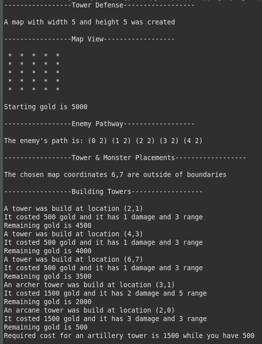
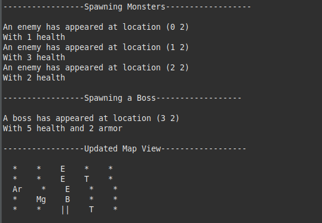

# Object Oriented Programming: Encapsulation

## Definition

**Encapsulation**  is defined as the wrapping up of data under a single unit. It is the mechanism that binds together code and the data it manipulates. Another way to think about encapsulation is, that it is a protective shield that prevents the data from being accessed by the code outside this shield.

-   Technically in encapsulation, the variables or data of a class is hidden from any other class and can be accessed only through any member function of its own class in which it is declared.
-   As in encapsulation, the data in a class is hidden from other classes using the data hiding concept which is achieved by making the members or methods of a class private, and the class is exposed to the end-user or the world without providing any details behind implementation using the abstraction concept, so it is also known as a  combination of data-hiding and abstraction.
-   Encapsulation can be achieved by Declaring all the variables in the class as private and writing public methods in the class to set and get the values of variables.
-   It is more defined with the setter and getter method.

## Advantages of encapsulation

-   **Data Hiding:** it is a way of restricting the access of our data members by hiding the implementation details. Encapsulation also provides a way for data hiding. The user will have no idea about the inner implementation of the class. It will not be visible to the user how the class is storing values in the variables. The user will only know that we are passing the values to a setter method and variables are getting initialized with that value.
-   **Increased Flexibility:**  We can make the variables of the class read-only or write-only depending on our requirement. If we wish to make the variables read-only then we have to omit the setter methods like setName(), setAge(), etc. from the above program or if we wish to make the variables write-only then we have to omit the get methods like getName(), getAge(), etc. from the above program
-   **Reusability:**  Encapsulation also improves the re-usability and is easy to change with new requirements.
-   **Testing code is easy:**  Encapsulated code is easy to test for unit testing.

## Implementation
**Classes:** Point, Map, MapLocation, Path, Tower, Enemy, Boss, Gold, Round, ArcherTower, ArcaneTower, ArtilleryTower

- **Point** - It is concerned with coordinates and distante
- **Map** - Creates a map a x b
- **MapLocation** - Checks if any given coordinate is within the map's boundaries and is also related to distance
- **Path** - Creates a path for the enemies to move through
- **Tower** - Builds a tower given the required constraints
- **Enemy** - Spawns an enemy with some given stats on the chosen path
- **Boss** - An enemy with special parameters including resistance, move speed and loss of game if not defeated
- **Gold** - Creates the in-game resource
- **Round** - Should initiate the action that takes place in each round
- **ArcherTower** - A tower with poison, roots
- **ArcaneTower** - A tower with insta-kill, teleportation
- **Artillery Tower**- A tower with area of effect attacks

## Results

