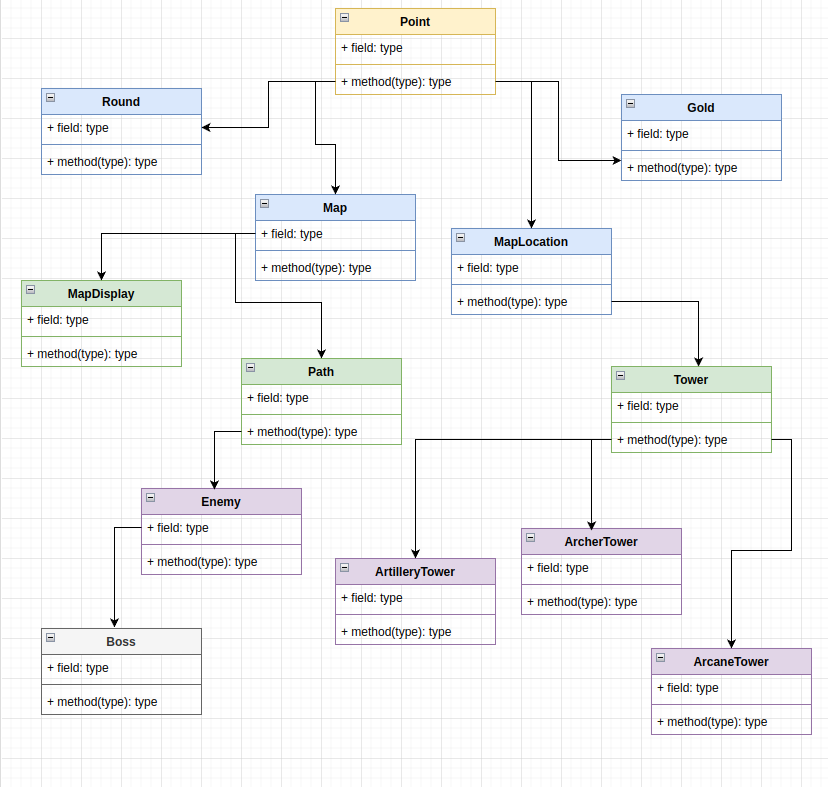
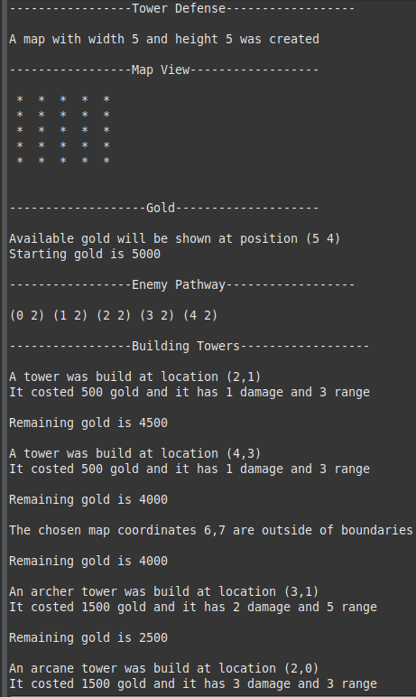
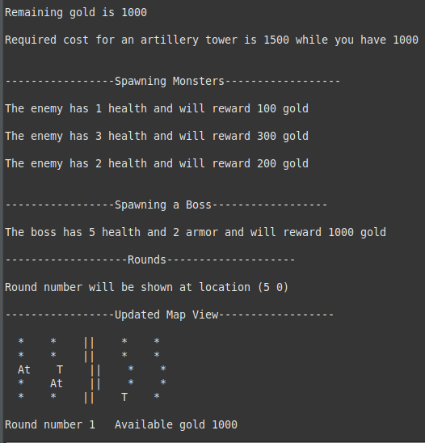

# Object Oriented Programming: Inheritance

## Definition
In object-oriented programming **inheritance** is the mechanism of basing an object or class upon another object (prototype-based inheritance) or class (class-based inheritance), retaining similar implementation. Also defined as deriving new classes (sub classes) from existing ones such as super class or base class and then forming them into a hierarchy of classes. In most class-based object-oriented languages, an object created through inheritance, a "child object", acquires all the properties and behaviors of the "parent object", with the exception of: constructors, destructor, overloaded operators and friend functions of the base class. Inheritance allows programmers to create classes that are built upon existing classes, to specify a new implementation while maintaining the same behaviors (realizing an interface), to reuse code and to independently extend original software via public classes and interfaces. The relationships of objects or classes through inheritance give rise to a directed acyclic graph.

## Inheritance diagram

## Analysis
The root class is the **Point** and thus each and every other class will possess the x and y parameters. **Gold** and **Round** given these coordinates will have a location chosen in which they will be displayed.
**Map** and **MapLocation** will also inherit the coordinates but will also add new methods on top of that available to the next sub classes. **MapDisplay** will have access to the boundaries of the map and so will the **Path** which down the line to **Enemy** and **Boss** will be able to create a system in which the **Enemy** and **Boss** will be able to move through a path and pass the end line.
On the other side **Tower** will inherit the coordinates and functions of the **MapLocation** as will the other 3 special towers, which will facilitate the placing of towers and also calculating the distance from them to the enemies. From **Tower** to **ArcaneTower**, **ArcherTower** and **ArtilleryTower** all will be able to use the previouse methods and will have an easiser time creating their specific ones, for example abilities and other different properties/parameters.

## Results

