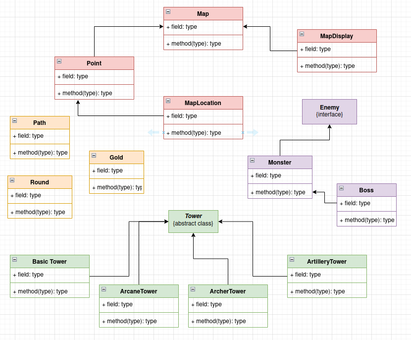

 # Object Oriented Programming: Polymorphism

## Definition
In programming language theory and type theory, **polymorphism** is the provision of a single interface to entities of different types or the use of a single symbol to represent multiple different types. The concept is borrowed from a principle in biology where an organism or species can have many different forms or stages.

The most commonly recognized major classes of polymorphism are:

-   _Ad hoc polymorphism:_ defines a common interface for an arbitrary set of individually specified types.
-   _Parametric polymorphism_: not specifying concrete types and instead use abstract symbols that can substitute for any type.
-   _Subtyping:_ when a name denotes instances of many different classes related by some common superclass.

### Static and dynamic polymorphism

Polymorphism can be distinguished by when the implementation is selected: statically (at compile time) or dynamically (at run time, typically via a virtual function). This is known respectively as _static dispatch_ and _dynamic dispatch,_ and the corresponding forms of polymorphism are accordingly called _static polymorphism_ and _dynamic polymorphism_.

Static polymorphism executes faster, because there is no dynamic dispatch overhead, but requires additional compiler support. Further, static polymorphism allows greater static analysis by compilers (notably for optimization), source code analysis tools, and human readers (programmers). Dynamic polymorphism is more flexible but slower—for example, dynamic polymorphism allows duck typing, and a dynamically linked library may operate on objects without knowing their full type.

Static polymorphism typically occurs in ad hoc polymorphism and parametric polymorphism, whereas dynamic polymorphism is usual for subtype polymorphism. However, it is possible to achieve static polymorphism with subtyping through more sophisticated use of template metaprogramming namely the curiously recurring template pattern.

When polymorphism is exposed via a library, static polymorphism becomes impossible for dynamic libraries as there is no way of knowing what types the parameters are when the shared object is built. While languages like C++ and Rust use monomorphized templates, the Swift programming language makes extensive use of dynamic dispatch to build the application binary interface for these libraries by default. As a result, more code can be shared for a reduced system size at the cost of runtime overhead

## The hierarchy of the classes

