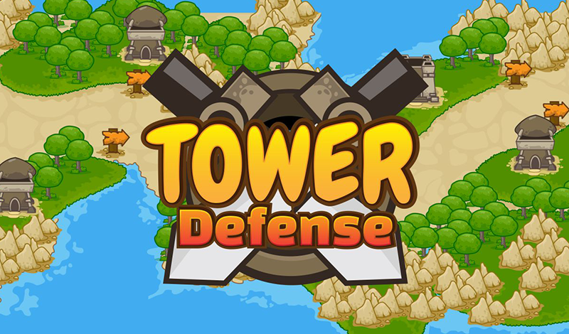

# Tower Defense Simulation

## Simulation
Each simulation represents a tower defense level with enemies, towers, bosses and how combinations of there values lead to either a victory or a loss 

## Parameters that can be changed
* Map size
* Enemy pathway
* Enemies/bosses
* Gold
* Lives
* Tower placings

## Example
A case would be that given enough lives and no active bosses, one will inevitably win against a horde of monsters by simply adding more lives than there are enemies alive

